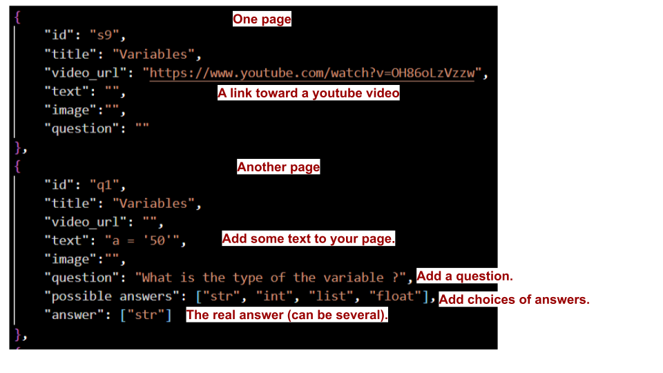

# Available studies

In this repository, you can find the different study contents available in this app.

## Directory organisation
* The first level of subdirectories indicates the language in which the study has been written.
* The second level of subdirectories indicates the category in which each study belong.
* The third level contains the names of each available study for that category.

## Study composition
Inside each third level directory, there must be 2 files:
* content.json
* ressources.zip

The content.json file indicates the elements to display on each study pages.

## The certificat of completion
TO be done.

The ressources.zip file contains all images referenced in the content.json file.

## All possible keys in the content.json file
| Name   | Type   | Description |
| :----: | :----: |    :----:   |
| id   | str  | Page id there for your convenience. The program does not use it.  |
| title | str | Page title |
| video_url | str | A public URL toward a video (tested on youtube only) | 
| video_source | str | The source of the video |
| video_start | int | The time in seconds at which you want the video to start playing. |
| image | str | The name or public URL toward an image |
| source_image | str | The source of your image |
| text | str | Some text to add on your page. If a video or an image is present, the text is shown underneath these elements. |
| question | str | A question asked to the user. |
| possible answers | list | The possible answers (multiple choice) showed to the user. |
| answer | list | The real answer(s). If several are possible, a multiselect option is given to the user. |

### Here is an exemple of what is inside the content.json file:

If you wish to add an image to a page, simply put the name of that image in the proper field in the content.json file (not show in the above exemple). The indicated image name needs to be present in the ressources.zip file. You do not need to specify the path to the ressources.zip file as it is implied by the architecture (and must be followed as is).

To add a gif to your presentation, the only supported way (for now) is to give a publicly available URL pointing to the gif. Showing a local gif (in the ressources.zip file) is not yet supported.